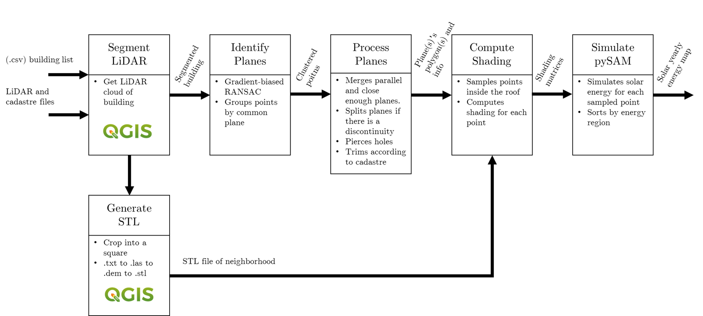

# Solar Potential Estimaton Tool
## Objective

This program was developed to assess the photovoltaic potential on solar rooftops of a building based on LiDAR data. LiDAR is a technique used to  detect distance to objects and, in the cases of buildings and geographical regions, LiDAR data is a sample of points with an x, y and z coordinates. To help with the delimiting of each building, cadastre info is used to obtain the polygon outline.

## Requirements
The following external apps are required:
- **LAStools** (available at https://lastools.github.io/download/): for las to txt conversion and viceversa.
- **QGIS** (available at https://qgis.org/en/site/forusers/download.html): for map operation.

This was tested on a custom anaconda environment using a Jupyter Notebook. Check the *environment.yml* file to see the required packages (with the version that was proved to work).

## Program structure

This code is designed to work on multiple buildings. So it is expected to handle a list of buildings, more than one cadaster file (or one single cadaster file with multiple buildings in it), and all the LiDAR files available.

To do so, the program contains two main modules: **Data preparation** and **Solar Estimation**. The file *main.py* contains a use example for both of them (however, data needed for the program to run is not provided in this repository).

Since the program creates multiple middle-step results, it has all been encapsulated in different classes that comunicate with each other, so that the user of this program only needs to specify the input data paths and the path for the desired output.

## Data Preparation

For the program to work three elements of information are required:
- A list of buildings with an identifier and their coordinates.
- The cadaster file(s) containing the polygon/outline of each building.
- The LiDAR file(s) containing the points from the buildings as well as their neighborhods.

The *DataPreparator* class in this program is responsible of preparing these file to compatible formats and to, in case of having multiple buildings or a large amount of data, pre-scan the data to summarize the most important information to make quicker searches afterwords.

The class contains the following methods:
- **prepare_buildings:** converts the buildings list to the same coordiantes as the LiDAR data, and also deletes duplicates in the list.
- **prepare_cadaster:** scans each cadaster file to know its span (minimum and maximum corners of the file) and export that information to a list in the same coordinates as the LiDAR data.
- **prepare_LiDAR:** scans each LiDAR file and exports a list with the limits (minimum and maximum corners) of each file, to simplify searches in the future.

## Solar Estimation

Onces the data is prepared, the solar simulation can begin. This is done with the help of the *SolarEstimator* class, that handles of the steps in the simulation process, as well as managing the directories of each input and output.

Once the class is instantiated, it needs to be updated with the paths of all the data information (LiDAR and cadastre files) and, then, it can start the process described in the following figure. 

### 1. Segment LiDAR
-  Code working 
-  Documentation 

### 2. Generate STL
-  Code working 
-  Documentation 

### 3. Plane identification
-  Code working 
-  Documentation 

### 4. Plane processing
-  Code working 
-  Documentation 

### 5. Compute Shading
-  Code working 
-  Documentation 

### 6. PySAM simulation
-  Code working 
-  Documentation 